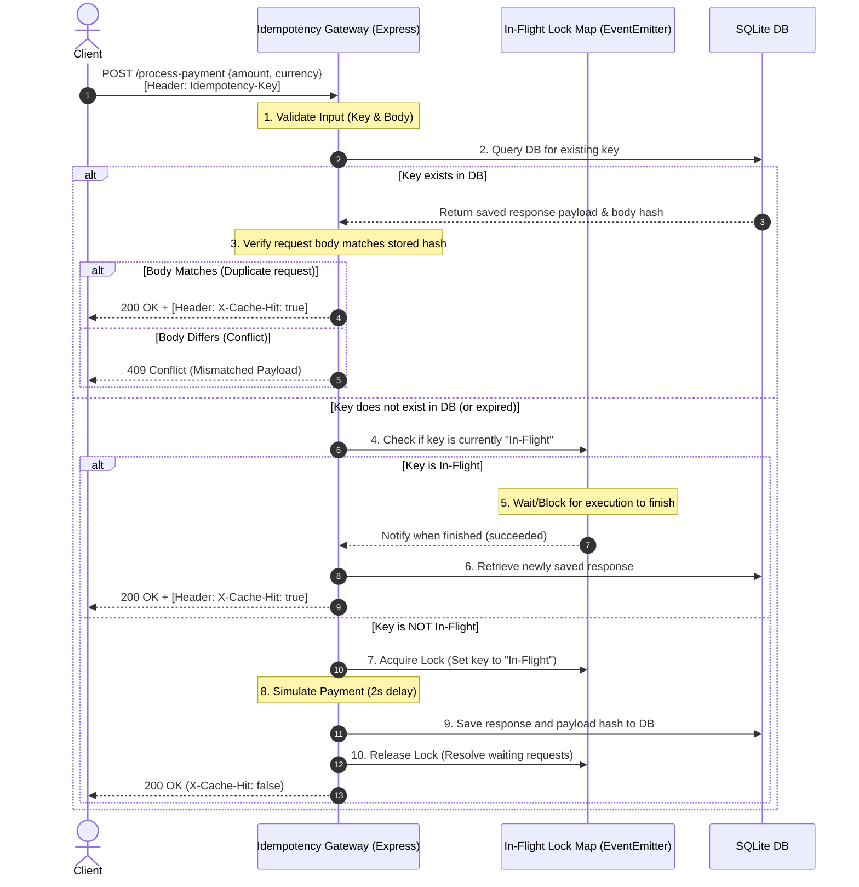

# Idempotency Gateway (The "Pay-Once" Protocol)

An idempotency layer middleware API built for **FinSafe Transactions Ltd.** to prevent double charging caused by client payment retries. It ensures that duplicate transactions with the same `Idempotency-Key` are processed **exactly once**, while returning the cached response for duplicate attempts, rejecting mismatched payloads, and handling concurrent requests.

---

## 1. Architecture Diagram

Below is the sequence diagram illustrating how requests are processed by the Idempotency Gateway:



---

## 2. Setup & Running Instructions

### Prerequisites
- Node.js (version 18 or above recommended)
- npm (Node Package Manager)

### Installation
1. Clone or download this repository.
2. Open terminal in the project directory and install dependencies:
   ```bash
   npm install
   ```

### Running the Server
To start the server locally:
```bash
npm start
```
The server will start on port `3000` (or `PORT` environment variable if set). You should see:
```text
SQLite database initialized successfully.
Idempotency Gateway listening on port 3000
```

### Running the Test Suite
We have a comprehensive Jest-based integration test suite testing all required scenarios:
```bash
npm test
```

---

## 3. API Documentation

### **Process Payment**
Simulates charging a user while verifying request idempotency.

- **URL:** `/process-payment`
- **Method:** `POST`
- **Headers:**
  - `Idempotency-Key` (Required): A unique string identifying the transaction (e.g., UUIDv4).
  - `Content-Type`: `application/json`
- **Request Body:**
  ```json
  {
    "amount": 100,
    "currency": "GHS"
  }
  ```

#### **Responses**

##### **1. First Request (Success)**
* **Status Code:** `200 OK`
* **Response Headers:** (No `X-Cache-Hit` header)
* **Response Body:**
  ```json
  {
    "message": "Charged 100 GHS"
  }
  ```

##### **2. Duplicate Request (Cache Hit)**
* **Status Code:** `200 OK`
* **Response Headers:** `X-Cache-Hit: true`
* **Response Body:**
  ```json
  {
    "message": "Charged 100 GHS"
  }
  ```

##### **3. Reused Key with Different Body (Conflict)**
* **Status Code:** `409 Conflict`
* **Response Body:**
  ```json
  {
    "error": "Idempotency key already used for a different request body."
  }
  ```

##### **4. Missing Header (Validation Error)**
* **Status Code:** `400 Bad Request`
* **Response Body:**
  ```json
  {
    "error": "Idempotency-Key header is required and must be a non-empty string."
  }
  ```

---

## 4. Design Decisions

1. **Language & Environment:** Built using **TypeScript** on **Node.js** with **Express**. TypeScript gives us compile-time safety and self-documenting types, while Express is highly extensible and perfect for writing custom middleware.
2. **Database Choice:** **SQLite** is used for persistent storage. It is lightweight, requires no external background server (unlike Redis or PostgreSQL), and creates a local `gateway.db` file. In test mode, it falls back to an `:memory:` instance for speed and isolation.
3. **In-Flight Lock Manager:** Implemented an in-memory lock using a Node.js `EventEmitter` to prevent race conditions during concurrent requests.
   - When a second identical request arrives while the first is still processing, it registers a listener on the event emitter and blocks.
   - When the first request completes, the lock is released, and the second request wakes up, fetches the cached response from the database, and returns it.
   - If the first request crashes, the lock is released, and the waiting request acquires the lock to attempt processing.
4. **Deterministic Body Hashing:** To verify if a reused key contains a different body, we sort the JSON object keys before computing a SHA-256 hash. This guarantees that request payloads containing identical keys but in a different order (e.g. `{"amount":100,"currency":"GHS"}` vs `{"currency":"GHS","amount":100}`) are recognized as the same request body.

---

## 5. The Developer's Choice

### **Feature: Key Time-To-Live (TTL) with Automated Cleanup**

In a real-world fintech application, keeping transaction logs/keys forever causes database size to grow indefinitely, impacting query speeds and costs. Furthermore, client systems only retry payments within a limited time window (usually up to 24 hours).

We implemented a **Key TTL (Time-To-Live)** safety feature:
1. **On-Demand Expiry:** When querying a key, the middleware checks its `created_at` timestamp. If it is older than 24 hours (86,400,000 ms), the record is automatically deleted, and the incoming request is processed as a fresh request.
2. **Background Cleaner:** On startup, the server registers a background interval that cleans up expired keys in SQLite once every hour (`clearExpiredRecords`). This maintains database size and ensures performance stays high indefinitely.
